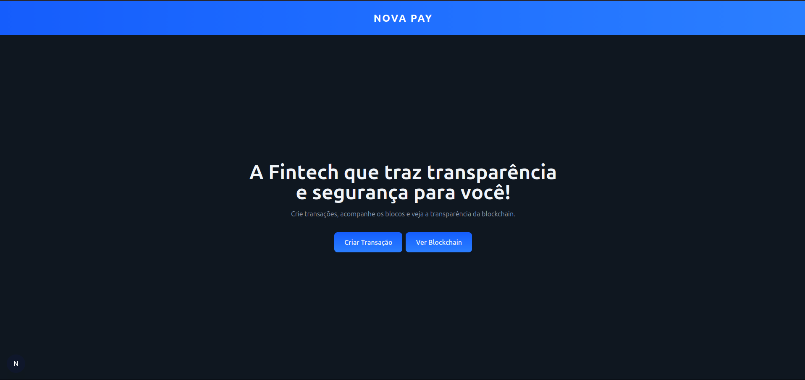
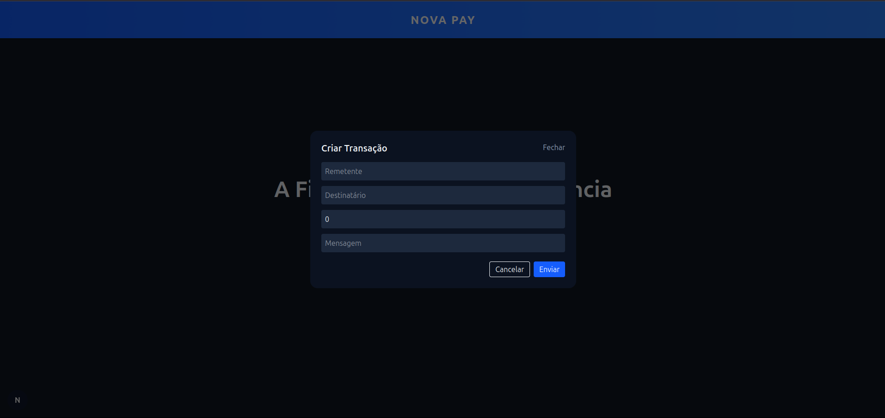
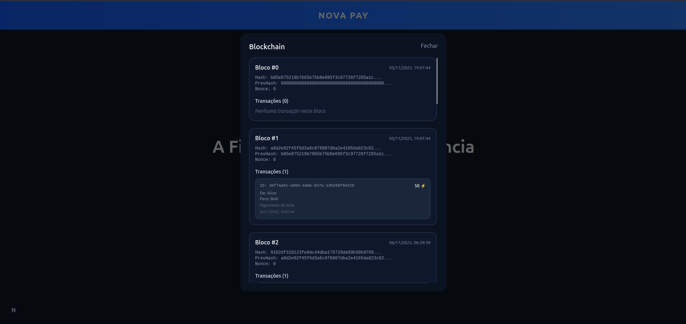

# Nova Pay

Interface para fintech que permite a criação de transações e acompanhamento dos registros públicos dentro de uma legder simulada.

## Objetivo

MVP para apresentação de um projeto de faculdade. O intuito é permitir a criação de transações e histórico dessas transações.

## Screenshots principais





## Instalação e uso

### 1️⃣ Backend (API)

Antes de rodar o site, você precisa iniciar a API.

- **repositório da API:** ...
- **Pré-requisitos:**
  - Node >= 22.16
  - npm >= 10.9

**Passos**:

```bash
# Clonar o repositório da API
git clone git@github.com:williamsanttos-dev/NovaPay.git
cd NovaPay

# Instalar dependências
npm install

# levantar o servidor
npm run start
```

### 2️⃣ Frontend (Web)

Com a API em execução, agora rode o servidor web

- **Pré-requisitos:**
  - Node >= 22.16
  - npm >= 10.9

**Passos**:

```bash
# Clonar o repositório da API
git clone git@github.com:williamsanttos-dev/NovaPayWeb.git
cd NovaPayWeb

# Instalar dependências
npm install

# levantar o servidor
npm run dev
```

## 💻 Backend

O backend deste projeto foi desenvolvido em **JavaScript**, e está disponível em:

👉 [Repositório da API](https://github.com/williamsanttos-dev/NovaPay)
